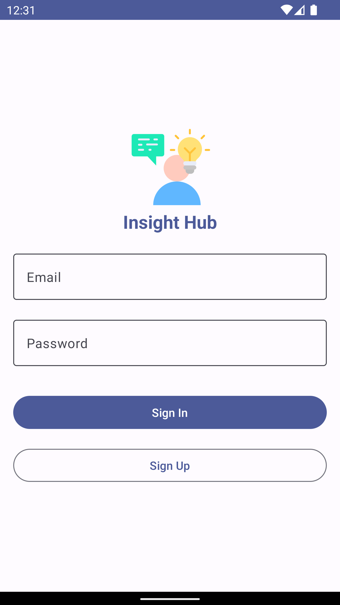
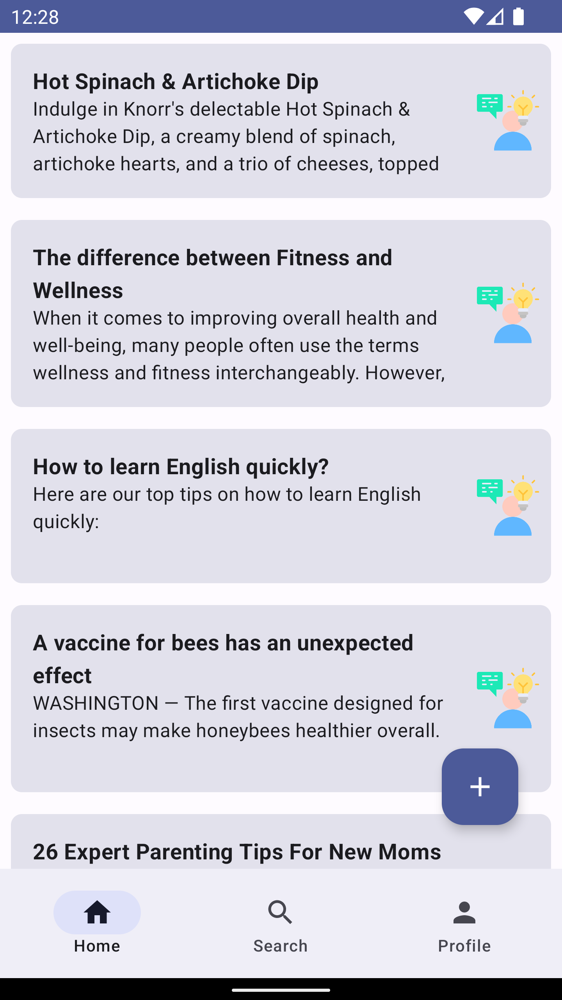
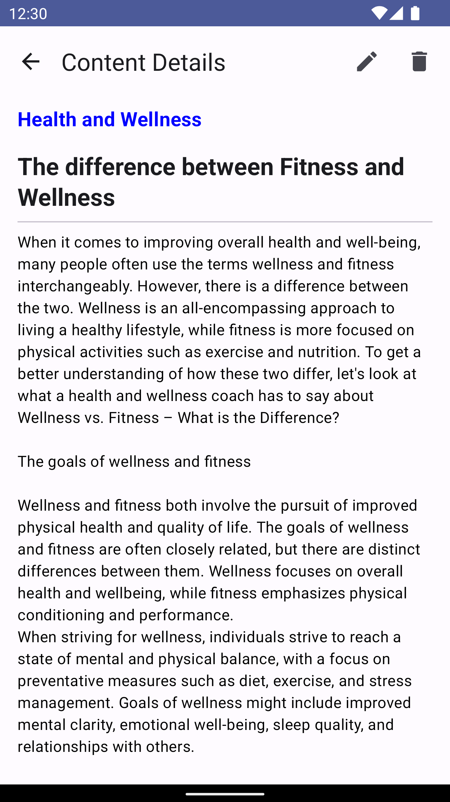
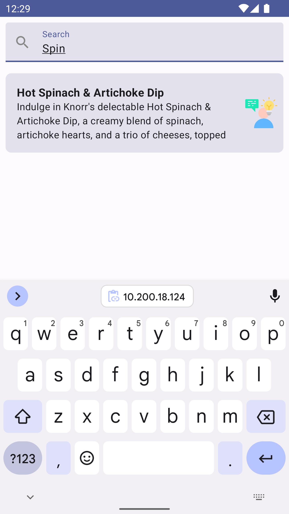

# Insight Hub Android App

### A platform for thinkers, writers, and storytellers to share their insights, ideas, and perspectives with audiences.

## Features
<li><strong>Browse Articles:</strong> Provide a feed of articles sorted by categories, popularity, or recency.</li>
    <li><strong>Search Articles:</strong> Enable users to search for articles by keywords or topics.</li>
    <li><strong>User Authentication:</strong> Allow writers to sign up, sign in, and manage their accounts.</li>
    <li><strong>Create Articles:</strong> Provide a rich text editor for writers to compose and format their articles.</li>
    <li><strong>Jetpack Compose UI:</strong> Modern UI toolkit for a visually appealing user interface.</li>

<h2>Getting Started</h2>

<h2>Screenshots</h2>

    
    
    
    
    

<h2>Contributing</h2>

  
Contributions are welcome! If you'd like to contribute to this project, feel free to submit issues or pull requests.

<h2>License</h2>

  
This project is licensed under the <a href="link-to-license-file">MIT License</a>.

<h2>Acknowledgements</h2>

  <ul>
    <li><a href="https://developer.android.com/jetpack/compose">Jetpack Compose Documentation</a></li>
    <li><a href="https://developer.android.com/guide">Android Developers Guide</a></li>
  </ul>

<h2>Contact</h2>

  
For any questions or suggestions, feel free to contact me: 
    <a href="mailto:phyothinzarr.aung@gmail.com">Phyo Thinzar Aung</a>

